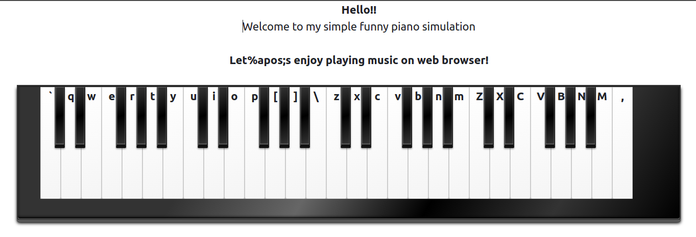

# Overview

# Author: trandinhlam.github.io

This is my simple funny piano web app simulation. Since the first time I code this app by Angular on July 2017, 
now I'm rewriting by using NextJS - a modern React framework and developing some cool features.

Have a look at the very simple UI:

# Features
+ Piano simulation, can be play by clicking your mouse into keys or using keyboard.

# Technologies & Techiques Used
+ ReactJS (NextJS via integrated Webpack, SASS, moduleCSS, ...)
+ Typescript
+ ESLint
+ XMLHttpRequest
+ AudioContext object
+ Some basic design patterns: Singleton, DI
+ 

# Prerequisites:
+ npm or npx
+ Nodejs version >=14

# How to run local environment step by step?

    npm i
    npm run dev

Then open the browser at [http://localhost:3000/piano](http://localhost:3000/piano)

# How to deploy using CI/CD process?

   + 

# Future improvements:

## Bug need to be fixed:
  + Duplicate previous note if tap too fast
  + First load seem like a litte bit slow because of binary .wav files

## Cool features:
  + Parallel click/tap for playing advance music include chords and
  + Search some Favorite song by name or artist, return pitch to practice if forget
  + Auto generate/track the performance and save locally or sync to server. So that user can save persistently.
  + Replay user's saved songs by get user's data from server
  + Recommend next notes when user stop too long, using some simple AI models

## Technicals:
  + Apply HTTP cache in order to reduce buffers download latency.
  + Refactor code for convenion implementation
  + Apply TailwindCSS for fast CSS custom
  + Using mp3/m4a file instead of .wav file to reduce storage size.