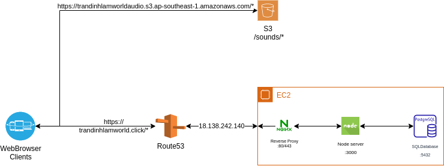

# Overview

## Author: trandinhlam

This is my simple funny piano web app simulation. Since the first time I have coded this app by Angular on July 2017, 
now I'm rewriting it by using NextJS - a modern React framework.

In the future I will develop some cool features in order to learn new powerful technologies and satisfy my passion for music.

The idea is inspired while I'm playing some interesting simple music games of [Amannotes](https://www.amanotes.com/products) such as Magic Tiles 3, Tiles Hop, Dancing Road,...

This is the hosted website: http://trandinhlamworld.click/piano.

Let feel free to contribute with me or send me your feedbacks, your awesome ideas or just give it a star :).

Thank you and let's enjoy music!!!

# Features
+ Piano simulation, can be play by clicking your mouse into keys or using keyboard.
Have a look at the very simple UI:

# Technologies & Techiques Used
+ Typescript
+ NextJS (ReactJS via ServerSide-rendering, SEO supported, integrated Webpack, SASS, moduleCSS, ESLint,...)
+ XMLHttpRequest, AudioContext objects
+ Some basic design patterns: Singleton, DI
+ ...

# Prerequisites:
+ npm or npx
+ Nodejs version >=14

# How to run local environment?

    npm i
    npm run dev

Then open the browser at [http://localhost:3000/piano](http://localhost:3000/piano)

# DevOps configurations:

## Server Architecture:

## CI/CD process:

# Future improvements: 

## Bugs needed to be fixed:
  + Duplicate previous note if tap too fast
  + First pageload seems like a litte bit slow because of binary .wav files

## Cool features:
  + Parallel click/tap for playing advanced music songs with chords and melody.
  + Search some Favorite song by name or artist, return the array pitch of song to practice if forget
  + Build a tool/section which allows user to insert the pitch of any song into the sharing database
  + Auto generate/track the performance and save locally or sync to server. So that user can save persistently.
  + Replay user's saved songs by get user's data from server
  + Recommend next notes when users stop too long, using some simple AI models
  + Online duet mode: Parallel playing between 2 players (1 left hand, 1 right-hand)

## Technical optimizations:
  + Upload and fetch audio file using Amazon S3
  + Apply HTTP cache and CDN in order to reduce buffers download latency
  + Refactor code for convenion implementation
  + Apply TailwindCSS for fast CSS custom
  + Using mp3/m4a file instead of .wav file to reduce storage size
  + Apply Google Analytics to analyze website performance